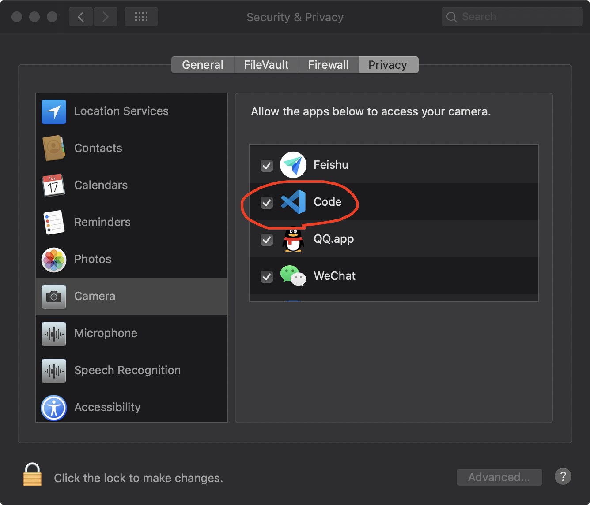

# Give VS Code Camera Access Permission on macOS

## Why?
By now if you run a program that needs to use the camera (as well as other video input sources) in VS Code, it will fail because VS Code doesn't have macOS's permission to access the camera. Also VS Code won't issue any prompt to ask for this permission.

## How to fix
A not so pretty workaround I found in this [GitHub issue](https://github.com/microsoft/vscode/issues/95062), but it will do.

Shell command:
```shell
cd ~/Library/Application\ Support/com.apple.TCC/
sqlite3 TCC.db 
```

Then insert this entry:
```shell
INSERT into access VALUES('kTCCServiceCamera',"com.microsoft.VSCode",0,1,1,NULL,NULL,NULL,'UNUSED',NULL,0,1541440109);
```

Exit and we're done.

Check `Settings -> Security & Privacy -> Camera`, the VS Code has already been granted camera access permission.



Now we can open VS Code and run a little test using OpenCV:
```python
import cv2

if __name__ == "__main__":
    cap = cv2.VideoCapture(1)
    
    while True:
        read_ok, frame = cap.read()

        if not read_ok or cv2.waitKey(16) == ord('q'):
            break

        cv2.imshow('Frame', frame)
```

It should run just fine.