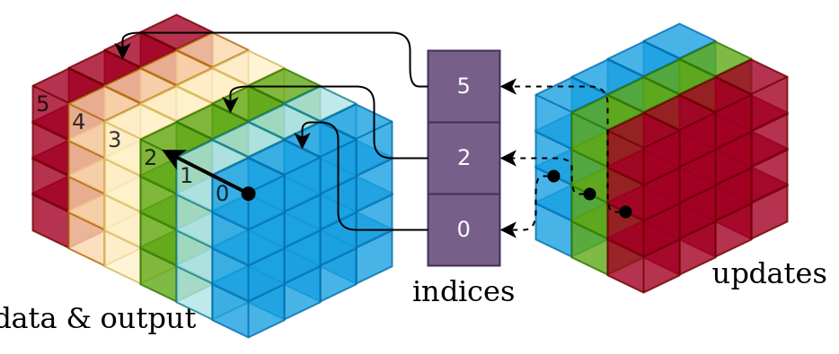

## What's the Deal?

Sometimes we need to grab some values from a tensor using indices given by anthor tensor. We may also need to **in-place-ly** update some values in a tensor, with a tensor of new values and a tensor of their indices. This can be achieved by *Gather-Scatter* operations（我喜欢叫：搞点-kō到！）. However, dealing with different definitions and implementations of Gather-Scatter ops from different DL frameworks can be nerve-racking. I'm not kidding, it's a hodgepodge!

Here is a table of various Gather-Scatter ops in common DL frameworks and inference libraries, where ops in each row are considered to have the same functionality, although their implementation details may differ.

| ONNX            | PyTorch            | TensorFlow   | TVM Relay        | TIM-VX    |
| --------------- | ------------------ | ------------ | ---------------- | --------- |
| GatherElements  | torch.gather       |              | relay.gather     |           |
| ScatterElements | torch.scatter      |              | relay.scatter    |           |
| Gather          | torch.index_select | tf.gather    | relay.take       | Gather    |
| GatherND        |                    | tf.gather_nd | relay.gather_nd  | GatherND  |
| ScatterND       |                    |              | relay.scatter_nd | ScatterND |

Let's take a look at them one by one.

## GatherElements

### Definition

> Inputs

- **data**: $\mathbf{X} \in \mathbb{X}^{N_0 \times \cdots \times N_{r-1}}$ with rank $r$.
- **indices**: $\Omega \in \mathbb{Z}_{+}^{N'_0 \times \cdots \times N'_{r-1}}$ with rank $r$.

> Parameters

- **axis**: $a \in \mathbb{Z}_{+}, 0 \leq a \leq r-1$.

> Output

- **output**: $\mathbf{Y} \in \mathbb{X}^{N'_0 \times \cdots \times N'_{r-1}}$ with rank $r$.

The operation is defined as (for simplicity, assume $r = 3$)

$$
\begin{aligned}
    \mathbf{Y}_{i, j, k} &\gets \mathbf{X}_{\hat{i}, j, k}, \hat{i} = \Omega_{i, j, k} & a = 0\\
    \mathbf{Y}_{i, j, k} &\gets \mathbf{X}_{i, \hat{j}, k}, \hat{j} = \Omega_{i, j, k} & a = 1\\
    \mathbf{Y}_{i, j, k} &\gets \mathbf{X}_{i, j, \hat{k}}, \hat{k} = \Omega_{i, j, k} & a = 2\\
\end{aligned}
$$

where $\Omega$ and $\mathbf{Y}$ always have the same shape.

Use python-style array accessing to demonstrate

```python
output[i, j, k] = data[indices[i, j, k], i, k] # axis == 0
output[i, j, k] = data[i, indices[i, j, k], k] # axis == 1
output[i, j, k] = data[i, j, indices[i, j, k]] # axis == 2
```

### Illustration

With $r = 3$ and $a = 1$


With $r = 3$ and $a = 2$


## ScatterElements

### Definition

> Inputs

- **data**: $\mathbf{X} \in \mathbb{X}^{N_0 \times \cdots \times N_{r-1}}$ with rank $r$.
- **indices**: $\Omega \in \mathbb{Z}_{+}^{N'_0 \times \cdots \times N'_{r-1}}$ with rank $r$.
- **updates**: $\mathbf{Z} \in \mathbb{X}^{N'_0 \times \cdots \times N'_{r-1}}$ with rank $r$.

> Parameters

- **axis**: $a \in \mathbb{Z}_{+}, 0 \leq a \leq r-1$.
- **reduction**: Type of reduction, can be `none` (default), `add` or `mul`.

> Output

- **output**: $\mathbf{X}$ with some elements updated.

The operation is defined as (assume $r = 3$)

$$
\begin{aligned}
    \mathbf{X}_{\hat{i}, j, k} &\gets \mathbf{Z}_{i,j,k}, \hat{i} = \Omega_{i, j, k} & a = 0\\
    \mathbf{X}_{i, \hat{j}, k} &\gets \mathbf{Z}_{i,j,k}, \hat{j} = \Omega_{i, j, k} & a = 1\\
    \mathbf{X}_{i, j, \hat{k}} &\gets \mathbf{Z}_{i,j,k}, \hat{k} = \Omega_{i, j, k} & a = 2\\
\end{aligned}
$$

Pretty much the inverse of `GatherElements`. The ONNX `ScatterElements` op also has `reduction = add/mul/none` parameter to control whether the update values will add/multiply to the selected elements in the data tensor or simply overwrite them (the default behavior). Some frameworks implement such *Scatter-and-Reduce* functionality by providing separate ops, e.g., the `torch.scatter_add` in PyTorch and the `relay.scatter_add` in TVM.

### Illustration

With $r = 3$ and $a = 1$


With $r = 3$ and $a = 2$


## Gather

### Definition

> Inputs

- **data**: $\mathbf{X} \in \mathbb{X}^{N_0 \times \cdots \times N_{r-1}}$ with rank $r$.
- **indices**: $\Omega \in \mathbb{Z}_{+}^{N'_0 \times \cdots \times N'_{q-2}  \times K}$ with rank $q$.

> Parameters

- **batch_dims**: $b \in \mathbb{Z}_{+}, 0 \leq b \leq r-1$. Defaults to $0$ (no batching).
- **axis**: $a \in \mathbb{Z}_{+}, b \leq a \leq r-1$. Defaults to $b$ (the outer-most axis).

> Output

- **output**: $\mathbf{Y} \in \mathbb{X}^{N'_0 \times \cdots \times N'_{q-2} \times \cdots \times N_{a-1} \times K \times N_{a+1} \times ... \times N_{r-1}}$ with rank $(q - 1) + r - b$.

The operation is defined as (assume $r = 3$ and $q = 2$, no batching)

$$
\begin{aligned}
    \mathbf{Y}_{m, n, :, :} &\gets \mathbf{X}_{\hat{i}, :, :},  \hat{i} = \Omega_{m, n} & a = 0\\
    \mathbf{Y}_{m, :, n, :} &\gets \mathbf{X}_{:, \hat{j}, :}, \hat{j} = \Omega_{m, n} & a = 1\\
    \mathbf{Y}_{m, :, :, n} &\gets \mathbf{X}_{:, :, \hat{k}}, \hat{k} = \Omega_{m, n} & a = 2\\
\end{aligned}
$$

It can be interpreted like this: $\Omega$ contains $N_0' \times \cdots \times N'_{q-2}$ (rank $q - 1$) indices groups (defined by the innermost dimension), and each group has $K$ indices. For each group, $K$ rank $r - 1$ slices are pulled out along the given axis from $\mathbf{X}$ using the indices, and then concatenated together along the same axis to form a "gathered" version of $\mathbf{X}$, which has rank $r$. Finally, stack all the "gathered" $\mathbf{X}$ s the same way as the indices groups are stacked in $\Omega$, obtaining the output $\mathbf{Y}$ of rank $(q - 1) + r$.

Use python-style array accessing to demonstrate

```python
output[m, n, j, k] = data[indices[m, n], j, k] # axis == 0
output[m, i, n, k] = data[i, indices[m, n], k] # axis == 1
output[m, i, j, n] = data[i, j, indices[m, n]] # axis == 2

# If axis == 0,
indices[m, :] # The m-th indices group
data[indices[m, :], :, :] # The m-th "gathered" data tensor
```

Now let's consider batching. The parameter $b$ represents the number of leading (starts from the outtermost one) batch dimensions. In most scenarios, $b = 1$. Obviously, the leading $b$ dimensions of $\mathbf{X}$ and $\Omega$ must have the same size.

The batched version is defined as (assume $r = 3,q = 2$ and $b = 1$)

$$
\begin{aligned}
    \mathbf{Y}_{m, n, :} &\gets \mathbf{X}_{m, \hat{i}, :}, \hat{i} = \Omega_{m, n} & a = 1\\
    \mathbf{Y}_{m, :, n} &\gets \mathbf{X}_{m, :, \hat{j}}, \hat{j} = \Omega_{m, n} & a = 2\\
\end{aligned}
$$

We can also view it as applying a non-batched `Gather` on every batch and stack the results along the batch dimensions, as demonstrated in the following python code

```python
# If batch_dims == 1,
for m in range(num_batches):
    axis_within_batch = axis - batch_dims
    output[m, ...] = gather(
        data=data[m, ...],
        indices=indices[m, ...],
        axis=axis_within_batch
    )
```

It's a pity that PyTorch's `torch.index_select` and TIM-VX's `Gather` currently don't support batching.

### Ilustration

With $r = 3, q = 2, b = 0$ and $a = 0$


With $r = 3, q = 2, b = 0$ and $a = 1$


With $r = 3, q = 2, b = 1$ and $a = 1$


## GatherND

### Definition

> Inputs

- **data**: $\mathbf{X} \in \mathbb{X}^{N_0 \times \cdots \times N_{r-1}}$ with rank $r$.
- **indices**: $\Omega \in \mathbb{Z}_{+}^{N'_0 \times \cdots \times N'_{q-2}  \times T}$ with rank $q$. Indexing tuples have rank $T$.

> Parameters

- **batch_dims**: $b \in \mathbb{Z}_{+}, 0 \leq b \leq r-1$. Defaults to $0$ (no batching).

> Output

- **output**: $\mathbf{Y} \in \mathbb{X}^{N'_0 \times \cdots \times N'_{q-2} \times N_{T+b} \times ... \times N_{r-1}}$ with rank $(q - 1) + (r - T) - b$.

The operation is defined as (assume $r = 3, q = 2, T = 2$, no batching)

$$
\mathbf{Y}_{m, :} \gets \mathbf{X}_{\hat{i}, \hat{j}, :},  (\hat{i}, \hat{j}) = \Omega_{m,:}
$$

We should view $\Omega$ as $N_0' \times \cdots \times N'_{q-2}$ (rank $q - 1$) indexing tuples (defined by the innermost dimension of $\Omega$) stacked together, each tuple has rank $T$. Well bummer, the TVM's `relay.gather_nd` defines the indexing tuples by the outtermost dimension of $\Omega$, following the MXNet (an obsolete DL framework that nobody gives a 💩about ) convention. To cope with this peculiar 😅behavior, we need to **transpose** the indices tensor prior to each `relay.gather_nd` when mapping `GatherND` ops from other DL frameworks to TVM. I do hope that TVM can get rid of this nasty holdover in the future!

Alright back to topic, for each rank $T$ indexing tuple, we use it to index $\mathbf{X}$ from the outtermost dimension (since there's no `axis` parameter anymore) and take out a slice of rank $r - T$ (e.g., when $r - T = 0, 1, 2, 3, \cdots$, the slice is an element, a line, a sheet, a cube and so on). Finally we stack the slices the same way as the indexing tuples are stacked in $\Omega$ to get the output $\mathbf{Y}$ of rank $(q - 1) + (r - T)$.

Use python-style array accessing to demonstrate

```python
output[m, k] = data[indices[m], k]

indices[m, :] # The m-th indexing tuple (i_hat, j_hat)
data[indices[m, :], :] # The m-th data slice
```

As for batching, it's similar to how we handle batching in `Gather`, just apply non-batched `GatherND` starting from the $(b + 1)$-th dimension of both $\mathbf{X}$ and $\Omega$.

The batched version is defined as (assume $r = 3,q = 2, T = 2$ and $b = 1$)

$$
\mathbf{Y}_{m} \gets \mathbf{X}_{m, \hat{i}, \hat{j}},  (\hat{i}, \hat{j}) = \Omega_{m,:}
$$

### Illustrations

With $r = 3, q = 2, T = 2, b = 0$


With $r = 3, q = 2, T = 2, b = 1$


## ScatterND

### Definition

> Inputs

- **data**: $\mathbf{X} \in \mathbb{X}^{N_0 \times \cdots \times N_{r-1}}$ with rank $r$.
- **indices**: $\Omega \in \mathbb{Z}_{+}^{N'_0 \times \cdots \times N'_{q-2}  \times T}$ with rank $q$. Indexing tuples have rank $T$.
- **updates**: $\mathbf{Z} \in \mathbb{X}^{N'_0 \times \cdots \times N'_{q-2} \times N_{T} \times ... \times N_{r-1}}$ with rank $(q - 1) + (r - T)$.

> Parameters

- **reduction**: Type of reduction, can be `none` (default), `add` or `mul`.

> Output

- **output**: $\mathbf{X}$ with some slices updated.

The operation is defined as (assume $r = 3, q = 2, T = 2$)

$$
\mathbf{X}_{\hat{i}, \hat{j}, :} \gets \mathbf{Z}_{m, :},  (\hat{i}, \hat{j}) = \Omega_{m,:}
$$

Use python-style array accessing to demonstrate

```python
data[indices[m], k] = updates[m, k]

indices[m, :] # The m-th indexing tuple (i_hat, j_hat)
updates[m, :] # The m-th updated slice
```

It is the inverse of `GatherND`, so not much to talk about. It also supports reduction as in `ScatterElements`.

### Illustrations

With $r = 3, q = 2, T = 1$



## Applications

### Select features by top-k scores

TODO

## Conclusion

Alas, vectorization is never easy! At least using these Gather-Scatter operations is still better than resorting to loops! We need to be extra careful about the definition and data layout differences across different frameworks (e.g., `torch.gather` is actually `GatherElements` not `Gather`, or TIM-VX uses `WHCN` layout instead of `NCHW` layout, so the indices tuples in `GatherND/ScatterND` should be reversed) when using these operators.

## References

1. [All About Gather-Scatter Operation in Deep Learning Framework](https://www.pathpartnertech.com/gather-scatter-operation-in-deep-learning-framework/)

2. [ONNX Operations Reference](https://github.com/onnx/onnx/blob/master/docs/Operations.md#Gather)

3. [TVM Relay API Reference](https://tvm.apache.org/docs/reference/api/python/relay/index.html)

4. [TIM-VX Operators Reference](https://github.com/VeriSilicon/TIM-VX/blob/main/docs/Operators.md)

5. [PyTorch Operations Reference](https://pytorch.org/docs/stable/torch.html)

6. [TensorFlow Operations Reference](https://www.tensorflow.org/api_docs/python/tf)
