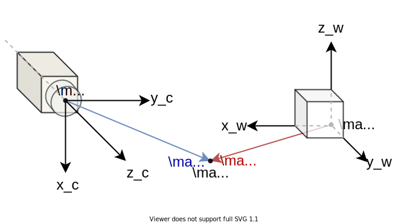
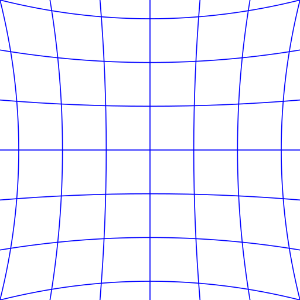

# Camera Calibration: The Basics

## 1 Camera geometry
To understand how a 3D point in the real world gets mapped into a 2D pixel in a digital image, we need to know about camera geometry.

### 1.1 The coordinate systems

The **world coordinates**, which describes a point $\mathbf{P}$ in the 3D real world, the origin is selected by people (e.g., the corner of a room).
> $\mathbf{x}_w = [x_w, y_w, z_w]^\top$ uint: $m$

The **camera coordinates**, which describes a point $\mathbf{P}$ in the 3D real world from the camera's perspective, the origin is the optical center of the camera.
> $\mathbf{x}_c = [x_c, y_c, z_c]^\top$ uint: $m$

The **image coordinates**, which describes a point $\mathbf{p}$ on the 2D image plane of the camera (sensor), the origin is the center of the image plane.
> $\mathbf{x}_i = [x_i, y_i]^\top$ uint: $m$

The **pixel coordinates**, which describes a 2D pixel postion on the 2D digital image. The origin is the left-top corner of the image.
> $\mathbf{x}_p = [u, v]^\top$ uint: `px`

So the process of image formation will be:
$$
\mathbf{x}_w \xrightarrow{\text{camera rigid motion}} 
\mathbf{x}_c \xrightarrow{\text{lens projection}} 
\mathbf{x}_i \xrightarrow{\text{digitization}} 
\mathbf{x}_p
$$

Before we go through the process step by step, let's first learn about **homogeneous coordinates**. It can represent a point in $n$-D space by a $(n+1)$-D vector.

For instance, we can represent a 3D point $\mathbf{x} = [x, y, z]^\top$ with homogeneous coordinates $\tilde{\mathbf{x}} = [\tilde{x}, \tilde{y}, \tilde{z}, \tilde{w}]^\top$

where

$$
[x, y, z]^\top = [
    \frac{\tilde{x}}{\tilde{w}}, 
    \frac{\tilde{y}}{\tilde{w}}, 
    \frac{\tilde{z}}{\tilde{w}}]^\top
$$

especially, when $\tilde{w} = 1$, $\overline{\mathbf{x}} = [x, y, z, 1]^\top = [\mathbf{x}, 1]^\top$ is called **augmented vector**.

Homogenous coordinates have these properties:
1. $\tilde{\mathbf{x}} = [\tilde{x}, \tilde{y}, \tilde{z}, \tilde{w}] = \tilde{w}[x, y, z, 1]^\top = \tilde{w}\overline{\mathbf{x}}$
2. $[k\tilde{x}, k\tilde{y}, k\tilde{z}, k\tilde{w}]^\top = [\tilde{x}, \tilde{y}, \tilde{z}, \tilde{w}]^\top$ scaling invariant
3. $[\tilde{x}, \tilde{y}, \tilde{z}, 0]^\top$ is a point at infinity
4. $[0, 0, 0, 1]^\top$ is the origin

This tool will come in handy later.

### 1.2 Camera rigid motion
First let's see how to map $\mathbf{x}_w$ to $\mathbf{x}_c$.

It will be a rotation combined with a translation, that is:
$$
\begin{aligned}
    \left[\begin{array}{c}
        x_c \\ y_c \\ z_c
    \end{array}\right] 
    &= 
    \left[\begin{array}{ccc}
        r_{11} & r_{12} & r_{13} \\
        r_{21} & r_{22} & r_{23} \\
        r_{31} & r_{32} & r_{33} \\
    \end{array}\right] 
    \left[\begin{array}{c}
        x_w \\ y_w \\ z_w
    \end{array}\right] 
    +
    \left[\begin{array}{c}
        t_x \\ t_y \\ t_z
    \end{array}\right] 
    \\
\end{aligned}
$$

denote as $\mathbf{x}_c = \mathbf{R} \mathbf{x}_w + \mathbf{t}$, it is an affine transform. 

How do we find the values in $\mathbf{R}$ and $\mathbf{t}$?

If we observe the origin and directions of the axes of the world coordinates in the camera coordinates, then the **columns** of $\mathbf{R}$ will be the direction vectors of the $x_w, y_w, z_w$ axes and $\mathbf{t}$ will be the coordinates of $\mathbf{o}_w$.

However it's often easier to observe the camera postion in world coordinates, then the **rows** of $\mathbf{R}$ will be the direction vectors of $x_c, y_c, z_c$ axes and $\mathbf{t}$ will be $-\mathbf{o}_c$ in world coordinates.

Using homogenous coordinates we can use a single matrix to encapsulate both rotation and translation:

$$
\left[\begin{array}{c}
    x_c \\ y_c \\ z_c
\end{array}\right] 
= 
\left[\mathbf{R} | \mathbf{t}\right]
\left[\begin{array}{c}
    x_w \\ y_w \\ z_w \\ 1
\end{array}\right] 
$$

or
$$
\left[\begin{array}{c}
    x_c \\ y_c \\ z_c \\ 1
\end{array}\right]  = 
\left[\begin{array}{cc}
    \mathbf{R} & \mathbf{t} \\
    \mathbf{0}^\top & 1
\end{array}\right] 
\left[\begin{array}{c}
    x_w \\ y_w \\ z_w \\ 1
\end{array}\right] 
$$

The matrix $\left[\mathbf{R} | \mathbf{t}\right]_{3 \times 4}$ is the **extrinsic matrix**, it has 6 DoF (Degree of Freedom).

### 1.3 Lens projection & digitization
Now we're viewing the world from the camera's perspective, now let's see how the camera map $\mathbf{x}_c$ to $\mathbf{x}_i$.

In the pinhole camera model, the length between the optical center and the image plane is the focal length $f$. We also assume the center of the image plane (principal point) is aligned with the optical axis, so there is no offset.

Using simple geometry, we have:
$$
\left\{
\begin{array}{c}
    \cfrac{x_i}{f} = \cfrac{x_c}{z_c} \\
    \cfrac{y_i}{f} = \cfrac{y_c}{z_c} \\
\end{array}
\right.
$$

expressed in homogeneous coordinates:
$$
z_c
\left[\begin{array}{c}
    x_i \\ y_i \\ 1
\end{array}\right] 
=
\left[\begin{array}{c}
    fx_c \\ fy_c \\ z_c
\end{array}\right] 
= 
\left[\begin{array}{cccc}
    f & 0 & 0 \\
    0 & f & 0 \\
    0 & 0 & 1 \\
\end{array}\right] 
\left[\begin{array}{c}
    x_c \\ y_c \\ z_c
\end{array}\right] 
$$

Now that the point has been projected on the image plane, the sensor can convert it into a pixel in the digital image.

where $s_x, s_y$ denotes the spacing between each pixel (or photoreceptor on a sensor), $(o_x, o_y)$ denotes the image center in pixel coordinates, usually we have $o_x = W/2, o_y = H/2$ where $W \times H$ is the resolution of the sensor.

We have:
$$
\left[\begin{array}{c}
    u \\ v \\ 1
\end{array}\right] 
= 
\left[\begin{array}{cccc}
    {1}/{s_x} & 0 & o_x \\
    0 & {1}/{s_y} & o_y \\
    0 & 0 & 1\\
\end{array}\right] 
\left[\begin{array}{c}
    x_i \\ y_i \\ 1
\end{array}\right] 
$$

We can combine the projection and digitization, so it maps a 3D point (in camera coordinates) directly to a pixel:
$$
z_c
\left[\begin{array}{c}
    u \\ v \\ 1
\end{array}\right] 
= 
\left[\begin{array}{cccc}
    {f}/{s_x} & 0 & o_x \\
    0 & {f}/{s_y} & o_y \\
    0 & 0 & 1\\
\end{array}\right] 
\left[\begin{array}{c}
    x_c \\ y_c \\ z_c
\end{array}\right] 
$$

denote as $z_c \overline{\mathbf{x}}_p = \mathbf{K} \mathbf{x}_c$, where $\mathbf{K}_{3 \times 3}$ is **intrinsic matrix**, it destribes the internal properties of the camera. $\mathbf{K}$ has 5 DoF.

### 1.4 Putting all together
Now we can put the camera extrinsics and intrinsics together to obtain a direct mapping from $\mathbf{x}_w$ to $\mathbf{x}_p$:
$$
z_c\overline{\mathbf{x}}_p = \mathbf{K}[\mathbf{R}|\mathbf{t}]\overline{\mathbf{x}}_w = \mathbf{P}\overline{\mathbf{x}}
$$

where $\mathbf{P} = \mathbf{K}[\mathbf{R}|\mathbf{t}]$ is the **camera matrix**, it has 11 DoF.

## 2 Radial distortion
Real world optical systems could introduce **radial distortion** that make a point on the image plane deviate from its expected position in the ideal pinhole camera model along the radial line from the center. The amount of deviation increases as the point is further from the center.

We can model the distortion as a polynomial function of the distance $r = x_i^2 + y_i^2$ from the principal point:

$$
\left\{
\begin{array}{c}
    x'_i = x_i(1 + \kappa_1 r^2 + \kappa_2 r^4) \\
    y'_i = y_i(1 + \kappa_1 r^2 + \kappa_2 r^4) \\
\end{array}
\right.
$$
where $\kappa_1, \kappa_2$ are called **radial distortion parameters**.

When $\kappa_1 > 0, \kappa_2 > 0$, $\mathbf{x}'_i$ is further from the center than the ideal point $\mathbf{x}_i$, it's called **barrel distortion**.

When $\kappa_1 < 0, \kappa_2 < 0$, $\mathbf{x}'_i$ is closer to the center than the ideal point $\mathbf{x}_i$, it's called **pincushion distortion**.

