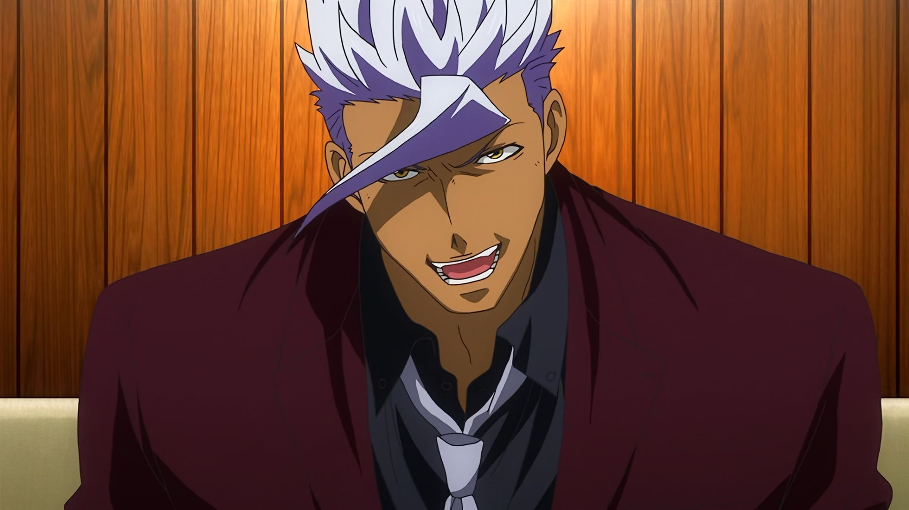
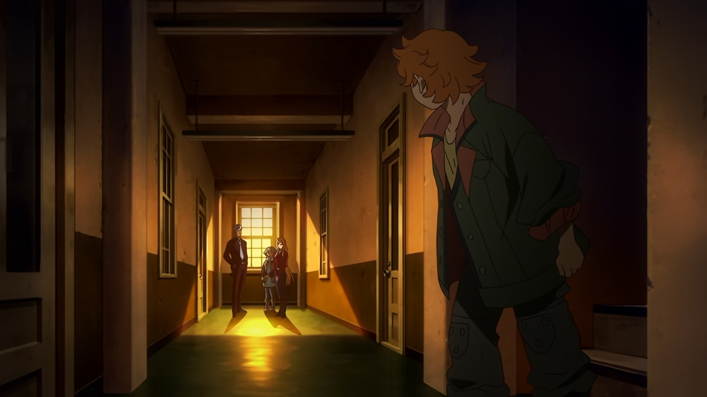
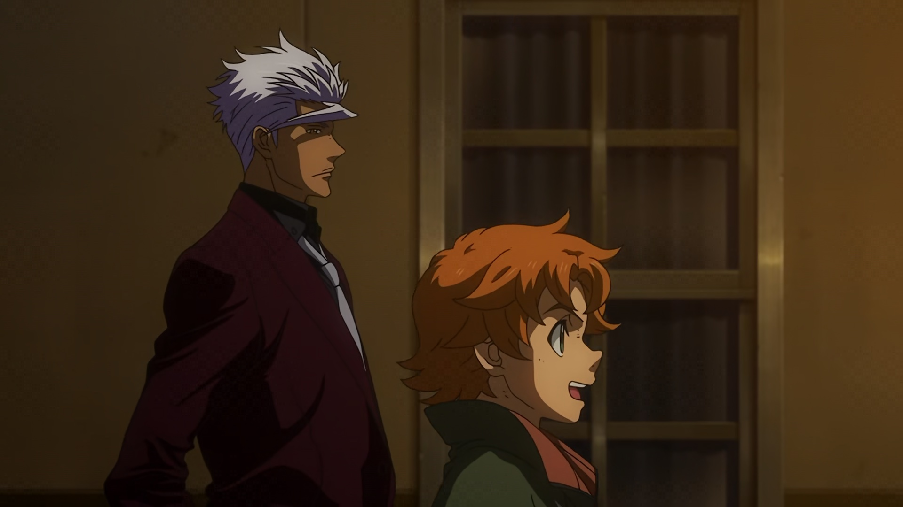
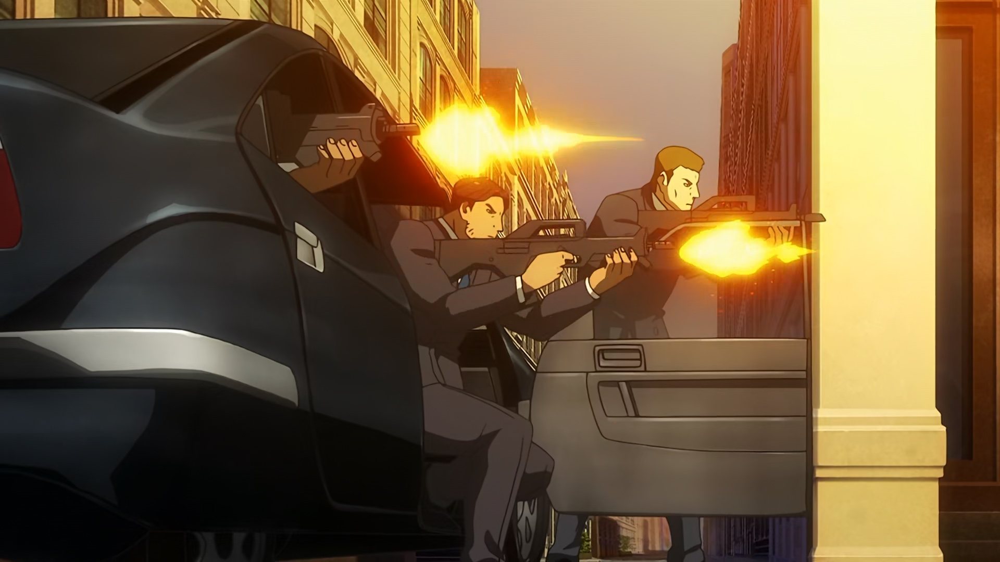

# 停不下来的奥尔加团长

## 万事俱备，只欠开花

**奥尔加**：事情已经准备妥当了~~指送死~~！查德，莱德，把车子开到后面去！

**查德和莱德**：吼！

## 催命鬼的召唤

**莱德**：团长，~~灵~~车准备好了！

**奥尔加**：哦！那么我上路了！~~引 申 义~~

**古荻莉亚**：好！一路走好！~~急着去投胎吧~~

## 刻在 DNA 里的街道

**莱德**：感觉真安静啊，街上也没有加拉尔霍恩的人，和总部差别真大啊。

**奥尔加**：啊，可能是他们把火星的战力都调到那里去了。

**莱德**：不过这也和我们没关系了。

**奥尔加**：你很高兴嘛。

**莱德**：那是当然的了！大家也有救了，塔卡基又那么努力~~高木过劳死~~，*我也是加把劲骑士!!!*

## 全 部 木 大

**奥尔加**：啊。（内心自白）没错，我们至今为止所做的一切，并不是全部徒劳的~~全 部 木 大~~。今后也是，只要我们不停下脚步，道路就会不断延伸……

(来週は夕方5時00分からお送りします)

**暗杀兵**：（乘坐黑色高级轿车突然杀出，对铁华团三人泼水）

**查德**：（肩部中弹倾倒）呃啊！

**奥尔加**：（抱住莱德蹲下，背后多次中弹）

**莱德**：团长，你在干什么啊，团长！！！

**奥尔加**：（转身掏出手枪射击）呃啊啊啊啊啊啊啊啊啊啊啊啊啊啊啊啊——————！！！

**暗杀兵**：（被击倒两人，驾车逃跑）

## 吾射不亦精乎

**奥尔加**：什么啊，我射得还蛮准的嘛，呵。

**奥尔加的血泊**：$f(x) = x^2$

**莱德**：团…团长……啊…啊……

## Ride On！

**奥尔加**：为什么要发出这种声音，莱德 ~~Ride On~~！

**莱德**：因为，因为——！

**奥尔加**：我可是铁华团团长，(站起) 奥尔加·伊兹卡啊，这点小伤没什么的。

**莱德**：为什么，要为了保护我——

**奥尔加**：保护团员就是我的使命！

**莱德**：（泪，流了下来）

**莱德**：但是！！

**奥尔加**：好了，快走！大家都在…等着你们。（内心自白）而且，三日，我终于明白了，我们的目的地根本不重要，只要继续前进就好了，只要不停下脚步，道路就会……不断延伸！

（奥尔加回忆与三日月的对话）

**三日月**：道歉的话我是不会原谅你的。

**奥尔加**：啊，我明白。

## 女人唱歌男人死
(希望之花歌词响起 ~~女 人 唱 歌 男 人 死~~)

**奥尔加**：我是不会停下来的，只要你们不停下来，那前面就一定有我！！！（倒下）

**众人**：（泪，流了下来）

## **所以啊，不要停下来啊！！！**

~~世    界    名    画~~

**奥尔加**：所以啊，不要停下来啊……

🎵 卡其脱离太，莫那莫那一 🎶