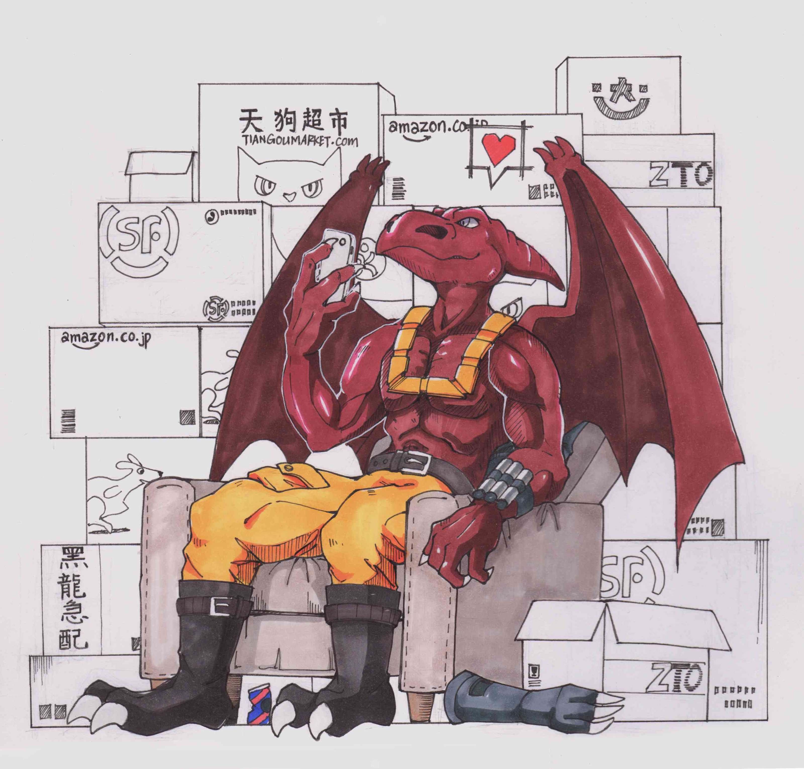

# Gotta come up with an idea to lure them into the Yunshan!

## 4.1 Concepts of Stationary Stochastic Process
### 4.1.1 Strict Stationarity
$\{X(t), t \in T\}$ is a real stochastic process, $\forall n > 1, t_1, t_2, \cdots, t_n \in T$ and $\tau \in T$, the two random vectors:
$$
[X(t_1), X(t_2), \cdots, X(t_n)]^\top \text{ and } [X(t_1 + \tau), X(t_2 + \tau), \cdots, X(t_n + \tau)]^\top
\text{KA}\TeX
$$
have the same joint CDF, then we call $\{X(t), t \in T\}$ a strictly stationary process. (Finite dimension distribution is unchanged by time)

### 4.1.2 Week Stationarity
$\{X(t), t \in T\} \in \mathcal{H}$, if:
1. $\forall t \in T$, $m_X(t) = \mathbb{E}[X(t)] = m_X = Constant$
2. $\forall s, t \in T$,$R_X(s, t) = R_X(t - s) = R_X(\tau)$

then we call $\{X(t), t \in T\} \in \mathcal{H}$ a weak (generalize) stationary process, or simply, stationary process.

$R_X(\tau)$ is the **auto-correlation function** of $\{X(t), t \in T\}$, and its covariance function is $C_X(\tau) = R_X(\tau) - |m_X|^2$, both are irrelevant of starting time.

### 4.1.3 Relationship between Strict and Weak Stationarity
1. Generally, strict stationarity  $\nLeftrightarrow$ weak stationarity
2. If $X(t)$ is strictly stationary and $X(t) \in \mathcal{H}$ (say, second order moment exists), then $X(t)$ is weak stationary.
3. For Gaussian process, strict stationarity  $\Leftrightarrow$ weak stationarity

## Auto-correlation Function of Stationary Process
### 4.2.1 Properties
For complex stationary process $\{X(t), t\in T\}$, its auto-correlation function $R_X(\tau)$ satisfies:
1. $R_X(0) \geq 0$
2. $|R_X(\tau)| \leq R_X(0)$, $|C_X(\tau)| \leq C_X(0)$
3. $R_X(-\tau) = R^*_X(\tau)$
4. Positive semi-definite

For periodic stationary process $\{X(t), t\in T\}$ with period $L$, say, $P\{X(t+L) = X(t)\} = 1$, its auto-correlation function is also $L$-periodic:
$$
\begin{aligned}
R_X(L) &= R_X(0)\\
R_X(\tau + L) &= R_X(\tau)
\end{aligned}
$$

### 4.2.2 Joint Stationary Process and Correlation Function
For stationary processes $\{X(t), t\in T\}$, and $\{Y(t), t\in T\}$, if:
$$
\forall \tau, R_{XY}(s + \tau, t + \tau) = R_{XY}(s, t)
$$
then $X(t)$, $Y(t)$ are joint stationary, their correlation function satisfies:

$$
R_{XY}(\tau) = R_{XY}(t, t + \tau) = \mathbb{E}[X(t)Y^*(t + \tau)]
$$

### 4.2.3 Mean Square Calculus of Stationary Process
For stationary process $\{X(t), t\in T\}$, we have:
1. $\lim_{\tau \to 0}R_X(\tau) = R_X(0) \Leftrightarrow \forall t_0 \in T, \mathop{\text{l.i.m}}\limits_{t \to t_0} X(t) = X(t_0)$
2. $\exist R''(0) \Leftrightarrow$ $\forall t \in T, \exist X'(t)$
    - $m_{X'}(t) = 0$
    - $R_{X'}(\tau) = -R''_{X}(\tau)$
    - $R_{XX'}(\tau) = R'_{X}(0) = 0$
    - $X(t)$ and $X'(t)$ are independent
3. $X(t)$ is mean square continuous, $R_X(\tau)$ satisfies (1) $\Rightarrow$
   $\exist \int_{a}^{b}X(t)dt$
    - $\mathbb{E}\left[ \int_{a}^{b}X(t)dt \right] = m_X(b - a)$
    - $\mathbb{E}\left[ \left(\int_{a}^{b}X(t)dt\right)^2\right] = 2\int_{a}^{b}\left[(b - a) - |\tau|\right] R_X(\tau) d\tau$

* $m_{X'}(t) = 0$
* $R_{X'}(\tau) = -R''_{X}(\tau)$
* $R_{XX'}(\tau) = R'_{X}(0) = 0$
* $X(t)$ and $X'(t)$ are independent
* 你看啊我的老伙计，我要写很多 the power of the darkness bullshit! Cao zou rua! 你个老鸡娃儿，老鸭娃儿，fö!

## 4.3 Ergodic Process
### 4.3.1 Ergodicity of Stationary Stochastic Process
For stationary process $\{X(t), t\in T\}$, we define:
$$
\hat{m}_X = \left<X(t)\right> \triangleq \mathop{\text{l.i.m}}\limits_{T \to \infty} \frac{1}{2T} \int_{-T}^{+T} X(t)dt
$$
as the time average estimate of mean of $m_X$ on $\R$, it is a **random variable**

For fixed $\tau$, we define:
$$
\hat{R}_X(\tau) = \left<X(t)X^*(t + \tau)\right> \triangleq \mathop{\text{l.i.m}}\limits_{T \to \infty} \frac{1}{2T} \int_{-T}^{+T} X(t)X^*(t + \tau) dt
$$

as the time average estimate of $R_X(\tau)$ on $\R$, it is a **stochastic process**

Note that $X(t)$ must be mean square integrable on any finite interval

If $P\{\hat{m}_X = m_X\} = 1$, $X(t)$ is said to be **mean-ergodic**

If $\forall \tau, P\{\hat{R}_X(\tau) = R_X(\tau)\} = 1$, $X(t)$ is said to be **autocorrelation-ergodic**

If $X(t)$ is both mean-ergodic and autocorrelation-ergodic, it is an **ergodic process**

Ergodic processes must be stationary, but not vise versa

If a stochastic process $X(\omega, t)$ is ergodic, from its single sample function $X(\omega_0, t)$ we can extract all information about the process

The key idea is to replace the ensemble average $m_X, R_X(\tau)$ with time average $\hat{m}_X, \hat{R}_X(\tau)$

### 4.3.2 Mean-ergodic Discriminant Criterion
Stationary process $\{X(t), t\in T\}$ is mean-ergodic if and only if:
$$
\lim_{T \to \infty} \frac{1}{2T} \int_{-2T}^{+2T}\left(1 - \frac{|\tau|}{2T}\right)C_X(\tau) d\tau = 0
$$

Deduction 1:
**Real** stationary process $\{X(t), t\in T\}$ is mean-ergodic if and only if:
$$
\lim_{T \to \infty} \frac{1}{T} \int_{0}^{+2T}\left(1 - \frac{\tau}{2T}\right)C_X(\tau)d\tau = 0
$$

Deduction 2:
**Real** stationary process $\{X(t), t\in T\}$ is mean-ergodic if:
$$
\int_{-\infty}^{+\infty}|C_X(\tau)|d\tau < \infty
$$

Deduction 3:
Stationary process $\{X(t), t\in T\}$ is mean-ergodic if:
$$
\lim_{\tau \to \infty} R_X(\tau) = m^2_X
$$

## 4.4 Spectrum Analysis of Stationary Process
### 4.4.1 Power Spectrum Density of Stationary Process
For stationary process $\{X(t), t\in T\}$, if it is mean square continuous, then its truncated Fourier transform exists:
$$
\mathcal{F}_X(\omega, T) = \int_{-T}^{+T} X(t)e^{-j\omega t} dt
$$

Also Parseval's identity is satisfied:
$$
\frac{1}{2T} \int_{-T}^{+T} |X(t)|^2dt = \frac{1}{2\pi} \int_{-\infty}^{+\infty}\frac{1}{2T}|\mathcal{F}_X(\omega, T)|^2 d\omega
$$

The left hand side and right hand side of the above equation are both random variables, let's take mean on both sides and let $T \to \infty$, lhs:
$$
\begin{aligned}
&\lim_{T \to \infty} \mathbb{E}\left[\frac{1}{2T} \int_{-T}^{+T} |X(t)|^2dt\right] \\
&=
\lim_{T \to \infty} \frac{1}{2T} \int_{-T}^{+T} \mathbb{E}[|X(t)|^2] dt \\
&=
\mathbb{E}[|X(t)|^2] \\
&=
R_X(0) = \Psi^2_X
\end{aligned}
$$
is the mean power of $X(t)$

rhs:
$$
\begin{aligned}
&\lim_{T \to \infty} \mathbb{E}\left[\frac{1}{2\pi} \int_{-\infty}^{+\infty}\frac{1}{2T}|\mathcal{F}_X(\omega, T)|^2 d\omega \right] \\
&=
\frac{1}{2\pi} \int_{-\infty}^{+\infty} \lim_{T \to \infty} \left[ \frac{1}{2T}\mathbb{E}[|\mathcal{F}_X(\omega, T)|^2]\right] d\omega
\end{aligned}
$$

We define the power spectrum density (PSD) as:
$$
S(\omega) \triangleq \lim_{T \to \infty} \left[ \frac{1}{2T}\mathbb{E}[|\mathcal{F}_X(\omega, T)|^2]\right]
$$

Now we can represent the above Parseval identity as:
$$
R_X(0) = \Psi^2_X = \frac{1}{2\pi}\int_{-\infty}^{+\infty}S_X(\omega)d\omega
$$

Note as the spectrum representation of the mean power of stationary process $X(t)$

### 4.4.2 Wiener–Khinchin Theorem
$\{X(t), t\in T\}$ is a stationary, mean square continuous process, $m_X = 0$, when its autocorrelation function $R_X(\tau)$ satisfies $\int_{-\infty}^{+\infty}R_X(\tau)d\tau < \infty$, then:
$$
R_X(\tau) \xleftrightarrow{\mathcal{F}} S_X(\omega)
$$

that is, the PSD and autocorrelation function of $X(t)$ are Fourier transform pair

We define
$$
\mathcal{F}_X(\omega) = \int_{-\infty}^{\omega} S_X(\omega) d\omega
$$

as the spectrum function of $X(t)$, is monotonically increasing (just like CDF)

### 4.4.3 Properties of PSD
1. $S(\omega) \in \R, S(\omega) \geq 0$
2. For **real** stationary process $X(t)$, $S_X(\omega) = S_X(-\omega)$

See https://github.com/users/Goose-Bomb for more.

## Code *blocks*

### Python
```python
import cv2
import numpy as np
import matplotlib.pyplot as plt

img_src = cv2.imread('images/yunshan_the_ultimate_kitty.heic')
img_rgb = cv2.cvtColor(img_src, cv2.COLOR_BGR2RGB)

plt.imshow(img_rgb)
plt.show()
```

### C#
```csharp
/// <summary>
/// A HTML renderer for a <see cref="MathInline"/>.
/// </summary>
/// <seealso cref="HtmlObjectRenderer{Figure}" />
public class HtmlMathInlineRenderer : HtmlObjectRenderer<MathInline>
{
    protected override void Write(HtmlRenderer renderer, MathInline obj)
    {
        var client = new HttpClient();
        string hey = client.GetString("https://docs.microsoft.com/en-us/aspnet/core/blazor/yeah");

        renderer.Write("<span").WriteAttributes(obj).Write(">\\(");
        renderer.WriteEscape(ref obj.Content);
        renderer.Write("\\)</span>");
    }
}
```

### C++
```cpp
/**
 * @brief Solve a linear assignment problem instance,
 *        the default goal is to minimize total cost
 *
 * @param cost Cost matrix (tasks x workers)
 * @param assignment Assignment indices (tasks -> workers)
 * @param assignmentReversed Reversed assignment indices (workers -> tasks)
 * @param maximize Set the goal to maximize total cost
 * @return  Optimal total cost
 */
float solve(const cv::Mat& cost,
            std::vector<int>& assignment,
            std::vector<int>& assignmentReversed,
            bool maximize = false);
```

## Media

### Cover image


### Long image


### Video player

漏⚡电⚡的⚡街⚡道


Skywalker Jr. Gonna cry?


### Inline images

找不到黑猫猫了  咋办嘛 

~~终 极 鹊 鸲 崽~~   ~鹊鸲崽子冬天吃得超肥变成了四喜丸子~ ！