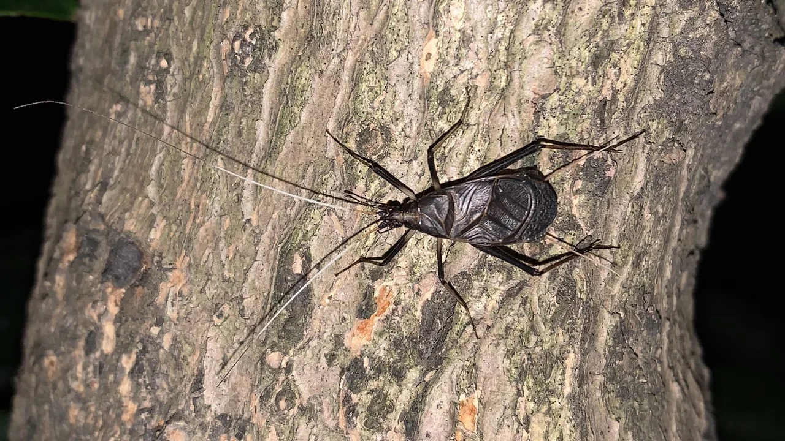
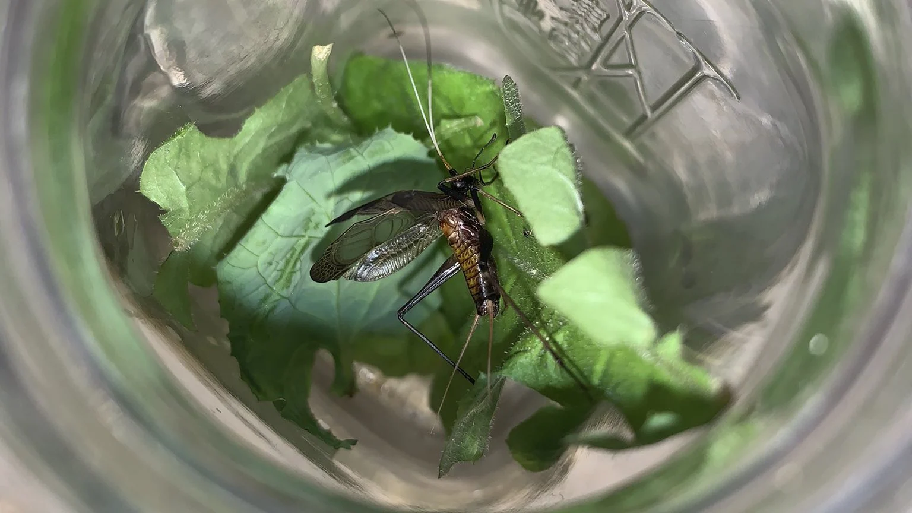
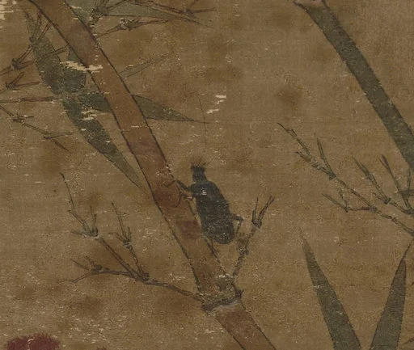

# 与金钟儿同行

## 日本钟蟋 Meloimorpha japonicus

### 介绍
中型蟋蟀，秋季常见鸣虫。身体黑色，扁平，腹部有金色花纹，雄性翅膀宽大，头部很小，复眼突出，长得就像一颗大号西瓜籽。触须丝状，黑白色。尾须琥珀色。雌虫翅膀窄，看起来比雄虫瘦长，有产卵管（剑尾亚目，yyds）。鸣声清脆，悠扬，穿透力强，因像摇一串金铃铛又被称为金钟儿，有的地方也称黑金钟、马蛉。日本称铃虫。

在我国有悠久的饲养玩赏历史，在北方与油葫芦、迷卡斗蟋、优雅蝈螽（蝈蝈）一起合称四大鸣虫。

有虫黑色，锐前而丰后，须尾皆歧，以跃飞，以翼鸣，其声蹬棱棱，秋虫也。暗即鸣，鸣竟刻，明即止，瓶以琉璃，饲以青蒿，状其声名之，曰金钟儿。——《帝京景物略》

### 分类学
* 直翅目
* 剑尾亚目
* 蟋蟀总科
* 蟋蟀科
* 蛛蟋科
* 钟蟋属
* 日本钟蟋

[iNaturalist 页面](https://www.inaturalist.org/taxa/471072-Meloimorpha-japonica) 

### 影像
---

小区绿化带中的金钟儿，拍摄于2020年9月，详情见 [iNaturalist 观察记录](https://www.inaturalist.org/observations/58732954)

---

雄性金钟儿在电子科技大学清水河校区品学楼前草丛欢叫

---

豢养于玻璃瓶中的雄性金钟儿，拍摄于2020年10月

---

游戏《动物森友会》中的金钟儿

---

宋画《竹虫图》中描绘的金钟儿

---

### Nullko 的评价
*这个世界需要更多的金钟儿！*
*冬天没有金钟儿给我唱歌听我要死了！*
